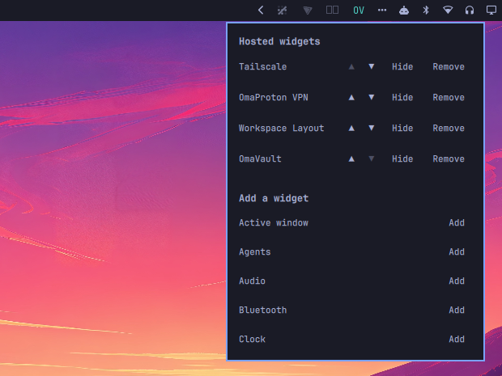

# Omarchy Menubar Manager

A Bartender/Ice-style menubar manager for the [Omarchy](https://omarchy.org)
bar: collapse other bar widgets into a hover-to-reveal drawer, so your bar
doesn't stay permanently cluttered with icons you only need occasionally.



## This is now a full bar replacement, not a widget

Versions before 1.0 installed as an ordinary bar widget (`bar-widget` kind)
sitting on Omarchy's stock bar. As of Omarchy 4.0.3, that approach lost the
shell-config write access hosting a widget needs (moving another plugin's
entry between `bar.layout` and the top-level `plugins[]` array) — Add and
Remove went permanently dead, with no workaround available from a
`bar-widget`-kind plugin. There's no narrower capability Omarchy exposes for
this; the only way back to working Add/Remove was to stop being a widget
*on* the bar and become the bar itself.

1.0 is a fork of Omarchy's own bar (`omarchy plugin clone omarchy.bar`),
with the hover-reveal drawer built directly into it. Practically, that
changes two things:

- **Installing it replaces your bar**, not adds a widget to it. See
  [Install](#install).
- Hosting is implemented differently under the hood — a hosted widget's
  `bar.layout` entry never moves, it just carries an inline `drawer: true`
  setting, so there's no more relocation dance and no more "where did this
  widget's settings go" uninstall caveat the old version had.

The tradeoff is honest: this plugin now tracks Omarchy's own bar engine and
needs to be kept in sync with it by hand, rather than riding on top of
whatever the stock bar becomes. That's the cost of the only capability that
actually restores Add/Remove.

## Why

The built-in system tray already has this hover-to-reveal drawer behavior,
but it's hardcoded to system-tray (SNI) icons only — there's no built-in way
to collapse an ordinary bar widget, first-party or third-party, the same
way. This plugin generalizes that mechanism to *any* registered bar widget.

## Features

- Works on horizontal (top/bottom) and vertical (left/right) bars alike
- Hover the ⋯ icon to reveal hosted widgets; move away and it collapses
  again
- The ⋯ icon sits immediately after the system tray in the drawer's section
  (right, by default)
- A manage popup (click the ⋯ icon) to add, remove, hide, or reorder widgets
- **Add** hosts a widget in the drawer
- **▲/▼** reorders a hosted widget within the drawer
- **Hide** keeps a widget hosted (its background service, if it has one,
  keeps running) without showing it anywhere
- Hosted widgets are rendered with the bar's own real widget machinery, not
  a hand-rolled stand-in: click to open their own panel, their own settings
  keep persisting, theming, tooltips, drag-reordering, and the open-panel
  indicator all work exactly as if they were sitting directly on the bar
- The drawer stays open for as long as a hosted widget's panel is open, so
  you can close it without hunting for the panel first

Everything else about the bar — every first-party widget, drag-to-reorder,
transparency toggle, bar position, custom `command`/`qml` modules — is
unchanged, because this is still that same bar underneath.

## Install

```bash
omarchy plugin add https://github.com/kevclarkco/omarchy-menubar-manager --enable --yes
```

`--enable` makes it your active bar immediately (that's what enabling a
`bar`-kind plugin means — no separate `omarchy bar use` step needed). Your
existing `bar.layout` in `shell.json` is unaffected; every widget you
already have placed keeps rendering exactly where it is.

To update later:

```bash
omarchy plugin update kc.omarchy-menubar-manager --yes
```

## Use

1. Click the ⋯ icon (either mouse button) to open the manage popup.
2. Under **Add a widget**, click **Add** next to anything you want to
   collapse into the drawer.
3. Hover the ⋯ icon to reveal what's hosted; click a hosted widget's icon
   to open its own panel, same as if it were still sitting directly on the
   bar.
4. Back in the manage popup: **▲/▼** to reorder within the drawer, **Hide**
   to keep it hosted but never shown, **Remove** to put it back in the
   normal strip.

## Limitations

- **Hosting is limited to one section** (`right`, by default) — a widget
  has to live in that section to be hosted. This keeps reordering within
  the drawer a plain same-array operation instead of inventing a
  cross-section ordering scheme.
- **Hotkey/CLI summon doesn't reach hosted widgets.** `omarchy toggle <id>`
  or a Hyprland keybind bound to a widget won't find it while it's hosted —
  clicking it inside the drawer still opens its panel fine, only *external*
  summon is affected.
- `omarchy.tray` can't be hosted: a hosted widget is only instantiated
  while the drawer is actually open (destroyed on every collapse, so a
  hidden widget's click targets can't be hit by a click elsewhere on the
  bar) — tray would lose its live SystemTray subscriptions and any open
  submenu on every single hover-out.

## Uninstall

Switch back to the stock bar first, then remove the plugin:

```bash
omarchy bar reset
omarchy plugin remove kc.omarchy-menubar-manager --yes
```

Removing it while it's still your active bar risks leaving `shell.json`
pointing at a plugin that no longer exists.

## How it works

`Bar.qml`/`BarModel.js` are Omarchy's own bar engine, forked via
`omarchy plugin clone omarchy.bar`. `DrawerWidget.qml` and `ModuleSlot.qml`
are the manager's own additions:

- Any `bar.layout.<section>` entry can carry an inline `drawer: true` (and
  `drawerHidden: true`) setting — the same shape as any other widget's
  inline settings, e.g. a clock's `format`. Entries carrying it are
  filtered out of the section's normal strip and rendered inside
  `DrawerWidget` instead, using the bar's own `ModuleSlot` component for
  every hosted widget, not a re-implementation of it.
- The ⋯ glyph itself is a render-time-only sentinel spliced into the
  section's rendered entries (never written to `shell.json`), positioned
  right after the tray.
- Hosting/un-hosting/hiding/reordering all persist through the same
  `mutateShellConfig` write path the bar already uses for drag-reordering —
  available here because this plugin *is* the bar (`kinds: ["bar"]`), which
  is the one thing a `bar-widget`-kind plugin can never get.

## License

MIT
