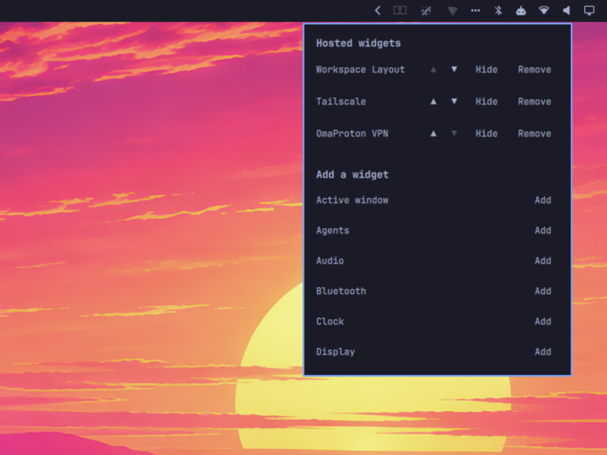

# Omarchy Menubar Manager

A Bartender/Ice-style menubar manager for the [Omarchy](https://omarchy.org)
bar. Tuck widgets you only need now and then into a drawer that opens when
you hover the ⋯ icon.



## Install

```bash
omarchy plugin add https://github.com/kevclarkco/omarchy-menubar-manager --enable --yes && omarchy restart shell
```

This plugin replaces Omarchy's bar rather than adding a widget to it.
`--enable` makes it your active bar straight away, and your existing layout
carries over unchanged.

Don't skip the shell restart: without it, the new bar can show only the ⋯
icon.

### Update

```bash
omarchy plugin update kc.omarchy-menubar-manager --yes && omarchy restart shell
```

The restart is needed here too: the shell only loads new bar code when it
restarts.

## Use

- **Open the drawer:** hover the ⋯ icon. Move away and it closes.
- **Manage the drawer:** click the ⋯ icon to open the manage popup.
  - **Add** puts a widget in the drawer.
  - **▲/▼** changes its position in the drawer.
  - **Hide** keeps it in the drawer but doesn't show it.
  - **Remove** puts it back on the bar.

Widgets in the drawer behave just as they do on the bar: click one to open
its panel, and its settings, tooltips and theming all work. The drawer stays
open while one of its widgets' panels is open.

Widgets in the drawer keep running while it's closed, hidden ones included,
so background work such as System Update's periodic check carries on.

You can also open a drawer widget's panel from the command line or a
keybind, for example `omarchy-shell shell toggle omarchy.bluetooth`. The
drawer opens around it.

Works on top, bottom, left and right bars.

## Settings

By default the drawer sits in the right section of the bar, just after the
system tray. To move it to the left section, add this inside the `bar`
object in `~/.config/omarchy/shell.json`:

```json
"drawer": { "section": "left" }
```

Widgets you had in the drawer on the right then reappear on the right of
the bar.

## Limitations

- The drawer only holds widgets from its own section. **Add** moves a widget
  from another section into the drawer's section first.
- The system tray can't go in the drawer. It already has its own hover
  drawer, and the ⋯ icon is placed next to it.
- This is a copy of Omarchy's bar with the drawer added, so it has to be
  updated by hand when Omarchy changes its bar.

## Uninstall

Switch back to the stock bar first, then remove the plugin. Removing it
while it's still the active bar can leave `shell.json` pointing at a bar
that no longer exists.

```bash
omarchy bar reset
omarchy plugin remove kc.omarchy-menubar-manager --yes
```

`omarchy bar reset` only switches back to Omarchy's bar. Your layout stays as
it is, and widgets that were in the drawer reappear on the bar.

## How it works

`Bar.qml` and `BarModel.js` are Omarchy's bar, copied with
`omarchy plugin clone omarchy.bar`. `DrawerWidget.qml` adds the drawer, and
`ModuleSlot.qml` is the bar's widget slot moved into its own file so the
drawer can reuse it.

- Putting a widget in the drawer adds `drawer: true` to its entry in
  `bar.layout` (plus `drawerHidden: true` if it's hidden). It's stored the
  same way as any other widget setting, such as a clock's `format`.
- The drawer shows each widget through the bar's own widget slot, so widgets
  behave exactly as they do on the bar.
- The ⋯ icon is added only when the bar is drawn. It's never saved to
  `shell.json`.
- Changes are saved the same way the bar saves drag-to-reorder. Only a full
  bar plugin can do that, which is why this plugin replaces the bar.

## License

MIT
